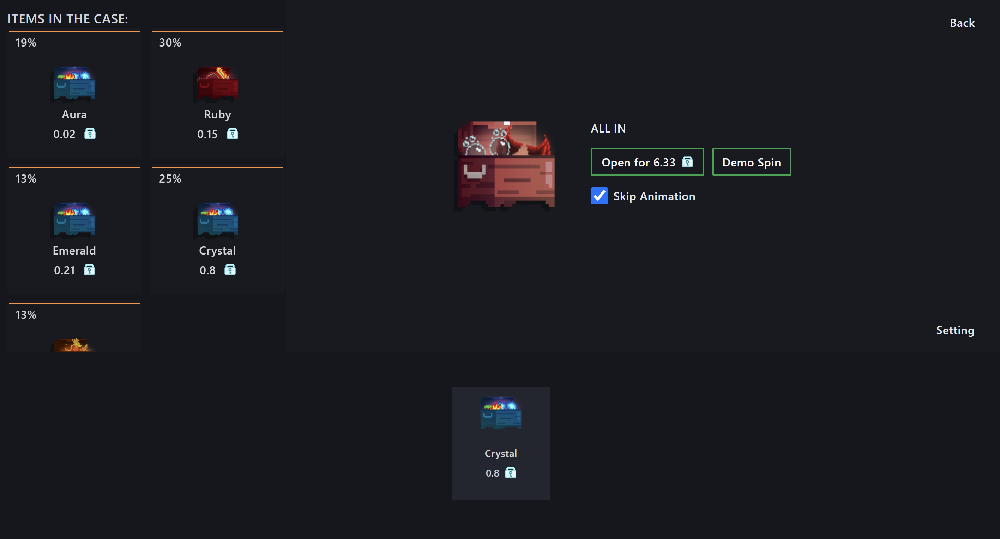

# Unboxing Game

This is a React-based frontend and Node.js-based backend project.
It is a gaming website where users use their coins to run the slider. The prizes that users can win depend on the amount they use to buy the ticket to slide the slider. 
The more they spend, the greater the value of the prizes in the case. However, the higher the price of an item in the case, the lower the probability of that item being the winning prize when the slider stops

## Screenshots

## Deployment

- I have deployed the frontend part of the website on AWS amplify and the backend part of the website on Vercel.

You can access it at: https://main.d3rorkfeyy5adx.amplifyapp.com/

